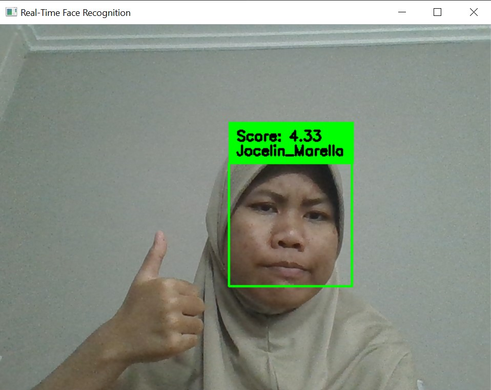
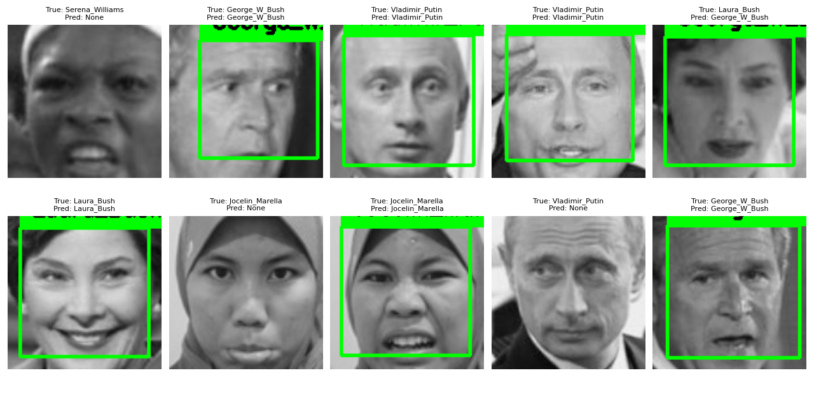

# Face Recognition Real-Time
Proyek ini merupakan implementasi sistem deteksi dan pengenalan wajah secara real-time menggunakan metode Eigenfaces dan OpenCV, sebagai bagian dari tugas Penglihatan Komputer dan Analisis Citra (PKAC).

## 📁 Struktur Folder
```bash
.
├── images/                     # Dataset wajah
├── venv/                       # Virtual environment (jika ada)
├── venv310/                    # Virtual environment (jika ada)
├── .gitignore                  # Git ignore file
├── eigenface_pipeline.pkl      # Model hasil training
├── main.py                     # Program utama real-time recognition
├── README.md                   # Dokumentasi proyek
├── requirements.txt            # List library yang dibutuhkan
├── workshop.py                 # Kode face recognition yang tidak real-time
```

## ⚙️ Instalasi
1. Clone repository ini:
```bash
git clone https://github.com/yourusername/Face_Recognition_Real_Time.git
```
2. Masuk ke folder proyek:
```bash
cd Face_Recognition_Real_Time
```
3. (Opsional) Buat dan aktifkan virtual environment:
```bash
python -m venv venv310
.\venv310\Scripts\activate  # Untuk Windows
```
4.. Install dependensi:
```bash
pip install -r requirements.txt
```

## 🚀 Cara menjalankan
Jalankan file utama untuk memulai real-time face recognition:
```python
python main.py
```
## ✨ Fitur
- Deteksi wajah dari webcam secara real-time
- Pengenalan wajah menggunakan metode Eigenfaces
- Pipeline model sudah meliputi mean-centering, PCA, dan SVM
- Model training hasil dari dataset lokal

## 📷 Contoh Output
Untuk real-time face recognition melalui webcam:

Non-real-time face recognition


## 👤 Author
- Nama: Jocelin Marella Ramadhaniska
- NIM : 23/512463/PA/21882
- Mata Kuliah: Penglihatan Komputer dan Analisis Citra

## 📌 Catatan Tambahan
- Folder venv/ dan venv310/ sebaiknya tidak di-push ke GitHub (sudah diatur lewat .gitignore).
- Model hasil training (eigenface_pipeline.pkl) bisa langsung digunakan tanpa retrain.
- Jangan lupa dataset (images/) harus ada di struktur yang sesuai agar program bisa berjalan.